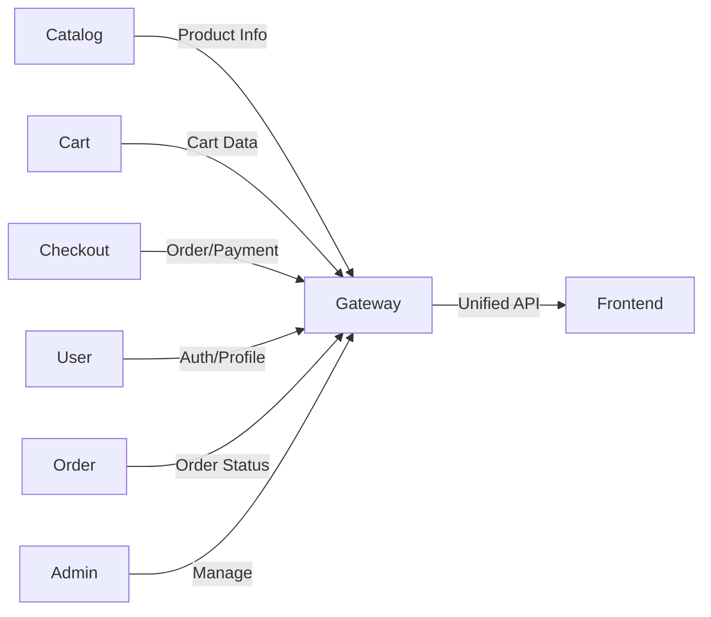

# System Architecture Overview

## Microservices

- **Catalog Service:** Product and category management
- **Cart Service:** Shopping cart management
- **Checkout Service:** Payment, order placement
- **User Service:** Authentication and profile
- **Order Service:** Order tracking and history
- **Admin Service:** Admin dashboard and controls
- **Gateway (optional):** API gateway/proxy

## Diagram

## Communication

- REST APIs between services
- Auth via JWT or similar