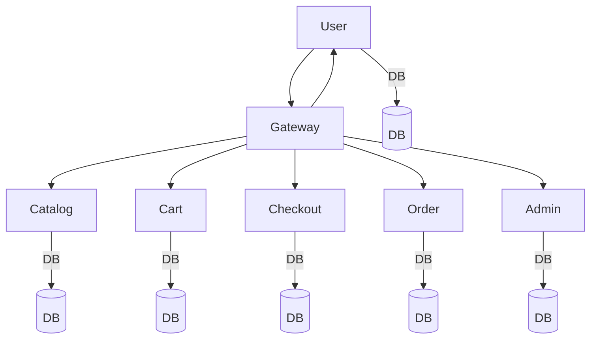

# Deployment & Infrastructure Documentation

## Environments
- Local Development
- Staging
- Production

## Deployment Steps
1. Build Docker image for each microservice.
2. Push images to container registry (e.g., Docker Hub, AWS ECR).
3. Deploy via Docker Compose (dev) or Kubernetes (prod).

## Infrastructure Diagram

## CI/CD Pipeline Overview
- Code pushed to GitHub
- Automated tests via GitHub Actions
- Build & push Docker images
- Deploy to staging/production

## Environment Variables
| Name                  | Service   | Description           | Example Value             |
|-----------------------|-----------|-----------------------|---------------------------|
| DATABASE_URL          | All       | DB connection string  | postgres://...            |
| JWT_SECRET            | User      | JWT signing key       | supersecretkey            |
| STRIPE_API_KEY        | Checkout  | Payment gateway key   | sk_test_...               |