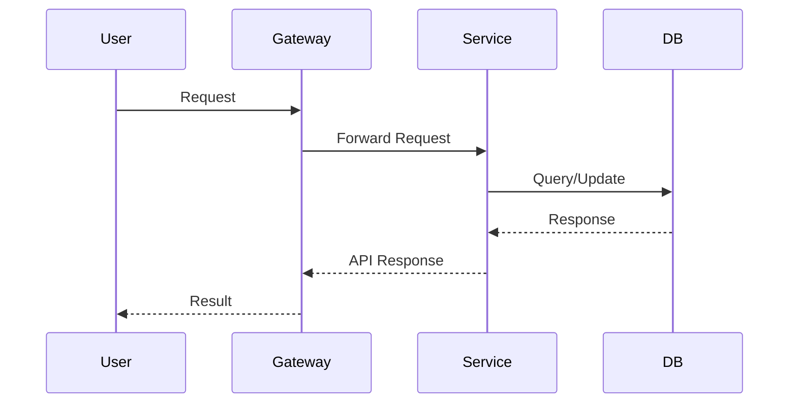

# Microservice Specification Template

## Overview
Brief summary of what this service does.

## API Endpoints
| Method | Path              | Description            | Auth Required | Error Codes      |
|--------|-------------------|-----------------------|---------------|------------------|
| GET    | /resource         | List resources        | Yes/No        | 400, 401, 500    |
| POST   | /resource         | Create resource       | Yes/No        | 201, 400, 401    |
| PUT    | /resource/:id     | Update resource       | Yes/No        | 200, 400, 404    |
| DELETE | /resource/:id     | Delete resource       | Yes/No        | 204, 404, 401    |

## Data Model
Describe main entities, fields, and relationships.

## Data Flow


## Error Codes

| Code | Description              | Typical Causes          |
|------|--------------------------|------------------------|
| 400  | Bad Request              | Input validation error |
| 401  | Unauthorized             | Missing/invalid token  |
| 403  | Forbidden                | Insufficient rights    |
| 404  | Not Found                | Resource missing       |
| 500  | Internal Server Error    | Unhandled exception    |

## Business Rules
- Rule 1: Only in-stock products can be purchased.
- Rule 2: Only admins can delete products.

## Security Considerations
- JWT for authentication
- Rate limiting on sensitive endpoints
- Input validation

## Example Requests/Responses
```http
GET /products
200 OK
[
  {
    "id": "123",
    "name": "Test Product",
    "price": 99.99
  }
]
```

## Audit & Logging
- Log all admin actions.
- Track failed login attempts.

## Monitoring
- Health endpoint: `/health`
- Metrics: API latency, error rate
